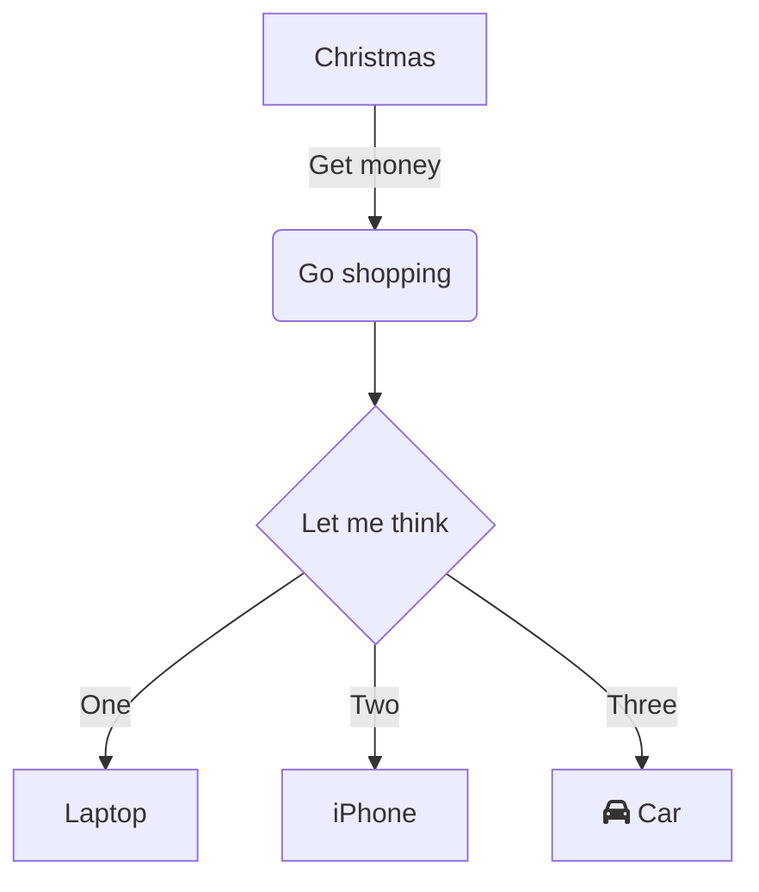

You can place your own lead paragraph here before the attribute *.p-lead* and the *more tag*. If you don't want to use special styling, just remove the attribute.
{.p-lead} <!--more-->

```mermaid 
graph TD
A[Christmas]  -->|Get money| B(Go shopping)
B --> C{Let me think}
C -->|One| D[Laptop]
C -->|Two| E[iPhone]
C -->|Three| F[fa:fa-car Car]
```

