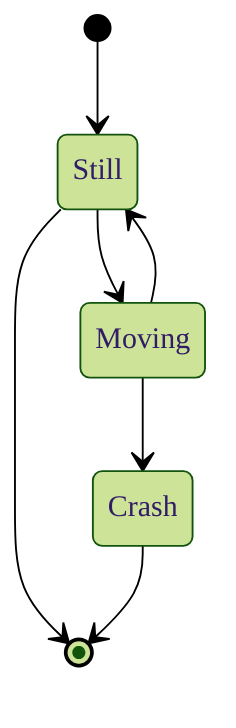
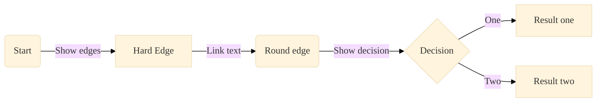
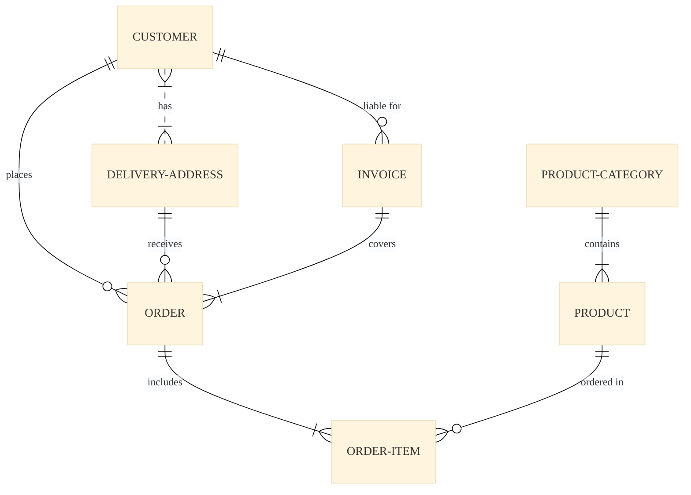

Mermaid is a popular Javascript library creating SVG diagrams from text and code descriptions.
{.p-first} <!--more-->

The [Mermaid site](https://mermaid.js.org) offers Tutorials and good documentation. 

## Syntax

```md {.left}
‍```mermaid
%%{init: { 
    "theme": "forest",
    "fontFamily": "ibm plex sans" 
}}%%
stateDiagram-v2
    [*] --> Still
    Still --> [*]
    Still --> Moving
    Moving --> Still
    Moving --> Crash
    Crash --> [*]
‍```
```

The diagram descriptions are formatted as [code blocks](doc/basic/code) with the language identifier `mermaid`. The example shows the code for the state diagram below.

Mermaid diagrams can change their color theme and also some attributes can be configured in a JSON preamble enclosed by `%%`.


Especially nice and professional is to use a font similar to the body copy.


Not all themes or configurable attributes are available with every type of diagram for now. We have to test our diagrams before we publish them. One good way is the official [Mermaid live editor](https://mermaid.live).

## Layout

The following diagrams are only a few examples to give an impression of the layout. More diagram types exist and their number is growing. 

### State diagram




### Flow chart



### Entity relation


