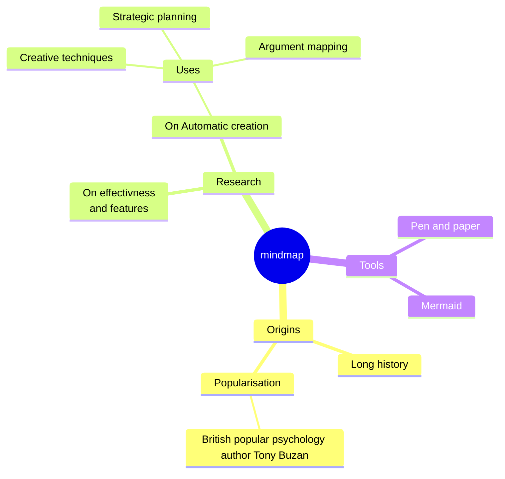

You can place your own lead paragraph here before the attribute _.p-first_ and the _more tag_. If you don't want to use special styling, just remove the attribute.
{.p-first} <!--more-->

```mermaid
mindmap
  root((mindmap))
    Origins
      Long history
      Popularisation
        British popular psychology author Tony Buzan
    Research
      On effectivness<br/>and features
      On Automatic creation
        Uses
            Creative techniques
            Strategic planning
            Argument mapping
    Tools
      Pen and paper
      Mermaid
```
