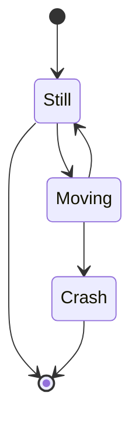

Mermaid is a popular Javascript library creating SVG diagrams from text and code descriptions.
{.p-first} <!--more-->

The [Mermaid site](https://mermaid.js.org) offers Tutorials and good documentation.

## Syntax

```md {.lh15 .left}
‍```mermaid
stateDiagram-v2
    [*] --> Still
    Still --> [*]
    Still --> Moving
    Moving --> Still
    Moving --> Crash
    Crash --> [*]
‍```
```

The diagram descriptions are formatted as [code blocks](doc/basic/code) with the language identifier `mermaid`. The example shows the code for a state diagram.
{.clear}

## Layout






