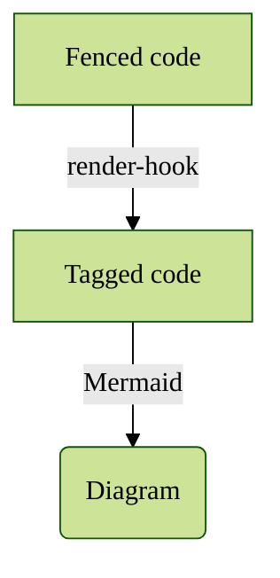

Mermaid is a Javascript library creating SVG diagrams from text and code descriptions. This Hugo module retrieves the library from the public CDN {$jsdelivr.com}.
{.p-first} <!--more-->

Mermaid diagrams are popular in the technical writing community because they are easy to code and can be tested immediately with the [Mermaid live editor](https://mermaid.live) or live preview plugins.


The Mermaid Javascript module seems to perform some caching. When we play with the diagram code in the Markdown editor the result shown by the Hugo server may not get updated completely.




The module processes fenced code blocks with the identifier `mermaid`. The diagram code inside the fences gets first wrapped by a `<figure>` tag and a `<pre>` tag as a container. Both tags include globally configured attributes. The `figure` tag also accepts optional code block attributes.

The code inside the container is rendered by Mermaid into an SVG diagram.

Mermaid diagrams are theme-able and some of their attributes are also configurable. We can have a site-wide configuration and local modifications. The code for the diagram in this posting includes a local JSON preamble for a specific configuration and the flowchart instructions:

```md
%%{init: { 
      "theme": "forest",
      "fontFamily": "ibm plex sans condensed"
}}%%
flowchart TB
  A[Fenced code] -->|render-hook| B[Tagged code]
  B -->|Mermaid| C(Diagram)
```

The module is [available on GitHub](https://github.com/bowman2001/hugo-mod-mermaid) and includes a small Hugo example site with more demos.
